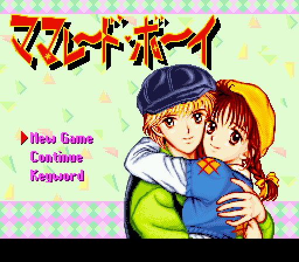
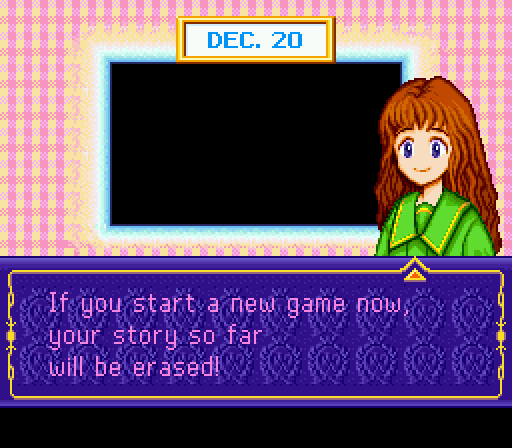
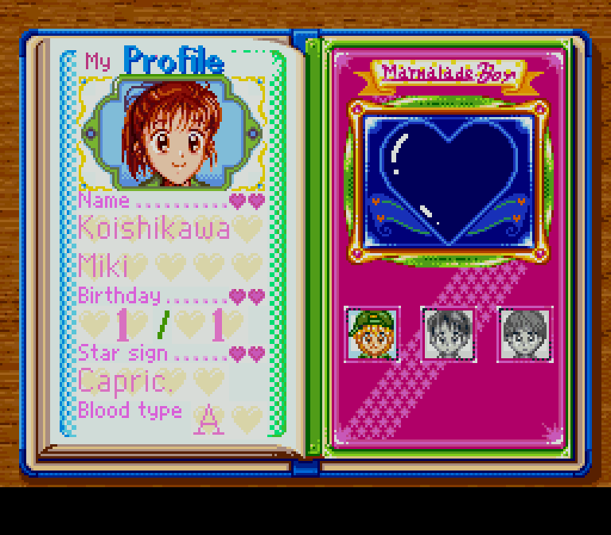

# Marmalade Boy (SFC) – English Translation

Fan translation patch for the Super Famicom game **Marmalade Boy** (ママレード・ボーイ, Bandai, 1995).

| | |
|---|---|
|  |  |
|  |  |

## Status

**Current version: v0.96 (beta)** – download `MarmaladeBoy_EN_v0.96_neocrypton.ips` from the
[latest release](https://github.com/neocrypton/MarmaladeBoy_EN-snes-public/releases/latest).

All text is translated; play-testing of every ending is still in progress and some graphics may
still be adjusted.

| Part | Status |
|---|---|
| Dialogue script | ✅ 5728 / 5728 lines translated and proofread |
| Menus, labels, fixed UI text | ✅ |
| Proportional (variable width) English font | ✅ |
| Name entry (English pages Aa / ABC / abc, up to 10 characters) | ✅ |
| Keywords (English words, see below) | ✅ |
| Diary entries (86) and planner end pages (9) | ✅ |
| Boys' data pages (names, star signs, colours, hobbies) | ✅ |
| Graphics with Japanese text (date plate, profile, boys' data pages, title menu, calendar, icons) | ✅ |
| Title logo and copyright line | left in the original on purpose |
| Play-testing | ⏳ Yuu route complete · Ginta route up to the good ending · Kei route up to the break-up ending |
| Still to test | good Kei ending, medium-affection endings |

Found a bug, overflowing text or a typo? Please open an issue with a screenshot and a short description
of where it happened.

## How to patch

1. Get a dump of the **Japanese** cartridge. The patch needs this exact file:

   | | |
   |---|---|
   | File | `Marmalade Boy (Japan).sfc` – **no** 512-byte copier header |
   | Size | 1,048,576 bytes (8 Mbit) |
   | CRC32 | `5299B3A6` |
   | MD5 | `0605a0f14051f95b959ec34f9256c1e6` |
   | SHA-1 | `50e72aebb03e3ea8c20146edcc5ad6ab40bc60ca` |

   If your file is 1,049,088 bytes it has a header – remove it first (e.g. with a header removal tool,
   or simply use the online patcher below, which can strip it).

2. Apply `MarmaladeBoy_EN_v0.96_neocrypton.ips` with any IPS patcher, for example
   [Rom Patcher JS](https://www.marcrobledo.com/RomPatcher.js/) (online),
   [Floating IPS (Flips)](https://github.com/Alcaro/Flips) or Lunar IPS.

3. The patched ROM should match:

   | | |
   |---|---|
   | Size | 2,097,152 bytes (16 Mbit – the ROM is expanded to fit the English script) |
   | CRC32 | `3885C5CC` |
   | MD5 | `b048251c0a1a2dbf393596c46a772dca` |
   | SHA-1 | `656734a148a5cc1444331f2082745e13485441a1` |

The patched game is tested with snes9x. The ROM header region is set to USA/NTSC.

## Keywords

Choose **Keyword** on the title menu and type one of these words (in capitals). Each one gives the same
bonus as the matching keyword of the Japanese original:

VOICE MEMO · MEDAL · LOVE CHECK · GENKI NOTE · POLISH · LOCKET MEMO · DIALER · MUSIC BOX · CROWN · MOMENT

## Translation notes

* Names are in Western order (*Miki Koishikawa*, *Yuu Matsuura*).
* When someone is called by their first name, the honorific stays (*Miki-chan*, *Yuu-kun*, *Kei-kun*,
  *Anju-san*); with family names it is dropped.
* Every character keeps their own way of speaking (Yuu's teasing, Ginta's bluntness, Kei's cheekiness …).
* Dates are shown as `DEC. 20`, birthdays as `12/20`.

## Legal

This is an unofficial, non-commercial fan translation. *Marmalade Boy* © Wataru Yoshizumi / Shueisha ·
Toei Animation, game © Bandai 1995. This repository contains **no ROM image** and no original game
data beyond what an IPS patch needs. Please do not ask for ROMs and do not distribute pre-patched ROMs.
